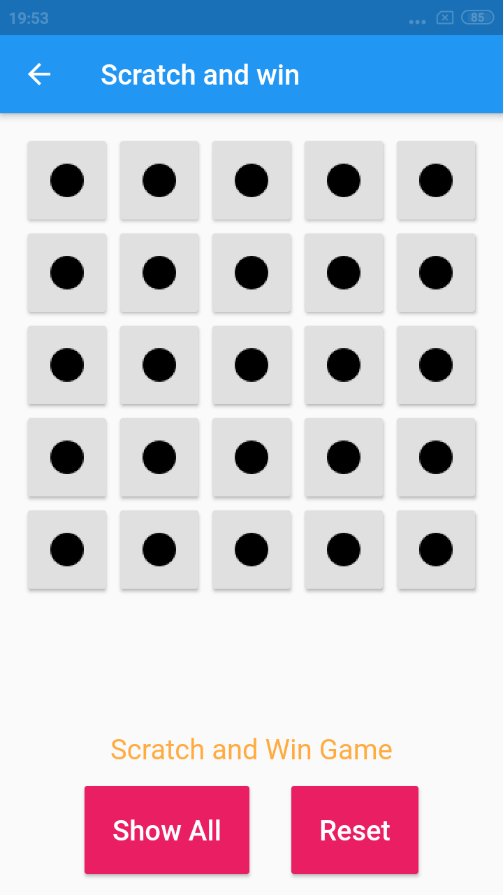

# Flutter Learning : Flutter basic to advance

A new Flutter project.

## Getting Started

This project is a starting point for a Flutter application.

A few resources to get you started if this is your first Flutter project:

- [Lab: Write your first Flutter app](https://flutter.dev/docs/get-started/codelab)
- [Cookbook: Useful Flutter samples](https://flutter.dev/docs/cookbook)

For help getting started with Flutter, view our
[online documentation](https://flutter.dev/docs), which offers tutorials,
samples, guidance on mobile development, and a full API reference.

## What is inside app

- **Navigation Drawer** : Flutter [Navigation Drawer Docs](https://api.flutter.dev/flutter/widgets/Navigator-class.html)

  - [code path](lib/navigation_drawer)

<table>
  <tr>
    <td>
      
    </td>
    <td>
      
    </td>
    <td>
      
    </td>
  </tr>
</table>

- **Random Background**: Randomly changing background and button color on button click.

  - [code path](lib/background_changer)

<table>
  <tr>
    <td>
      
    </td>
    <td>
      
    </td>
    </tr>
</table>

- **Dice Roller**: Randomly changing dice images on button click.

  - [code path](lib/dice_roller)

<table>
  <tr>
    <td>
      
    </td>
    <td>
      
    </td>
  </tr>
</table>

- **Tic Tac Toe**: Simple Tic Tac Toe game.

  - [code path](lib/tictactoe)

<table>
  <tr>
    <td>
      
    </td>
  </tr>
</table>

- **Scratch Win Game**: A game in which one of the tile (button) has a rupee image hidden behind it. only have three chance to find out.

  - [code path](lib/scratch_win)

<table>
  <tr>
    <td>
      
    </td>
    <td>
      
    </td>
  </tr>
</table>

- **Spanish Audio**: Audio Player App. flutter [*'audioplayers'* plugin](https://pub.dev/packages/audioplayers) used. assets folder contain some audio file which will be played this app.

  - [code path](lib/spanish_audio)

<table>
  <tr>
    <td>
      
    </td>
  </tr>
</table>

- **Signup Page**: Signup form page and transfer data to home page. [Global key](https://api.flutter.dev/flutter/widgets/GlobalKey-class.html) help to transfer data.

  - [code path](lib/signup)

<table>
  <tr>
    <td>
      
    </td>
    <td>
      
    </td>
  </tr>
</table>

- **Github Api**: Github api : [api.github.com/users](https://api.github.com/users) used with help of flutter [*'http'* plugin](https://pub.dev/packages/http) which worked as networking library.

  - [code path](lib/api_fetch/github_api)

<table>
  <tr>
    <td>
      
    </td>
  </tr>
</table>

- **Random Api**: Random user generating api : [randomuser.me/api/?results=50](https://randomuser.me/api/?results=50) used with help of flutter [*'http'* plugin](https://pub.dev/packages/http) which worked as networking library.

  - [code path](lib/api_fetch/random_user)

<table>
  <tr>
    <td>
      
    </td>
  </tr>
</table>

- **Local Database**: Simple notes making app, it store notes in local database. [*'sqflite'* plugin](https://pub.dev/packages/sqflite) used as local database, [*'intl'* plugin](https://pub.dev/packages/intl) used to manipulate date, [*'path_provider'* plugin](https://pub.dev/packages/path_provider) used to get device/phone storage path.

  - [code path](lib/db_todo)

<table>
  <tr>
    <td>
      
    </td>
    <td>
      
    </td>
  </tr>
</table>

- **Firebase Authentication**: Firebase Authentication app simple signup, signin, and home page to show login. [Flutter Firebase Authentication docs](https://firebase.google.com/docs/flutter/setup)

  - [code path](lib/firebase_auth)

<table>
  <tr>
    <td>
      
    </td>
    <td>
      
    </td>
    <td>
      
    </td>
  </tr>
</table>

### Credits :

- Udemy Tutorial : [Complete Flutter Development.](https://www.udemy.com/course/complete-flutter-development)
- Icon by <a target="_blank" href="https://icons8.com">Icons8</a>
- and few of my inputs and logic.
